# 基于微信云开发的餐饮店点餐小程序

[](https://developer.mozilla.org/zh-CN/docs/Web/JavaScript)
[](https://developers.weixin.qq.com/miniprogram/dev/framework/)
[](https://developers.weixin.qq.com/miniprogram/dev/wxcloud/)
[](LICENSE)
[](https://github.com/MiChuan/crush/stargazers)

本项目基于 MIT License 开源发布，欢迎在遵守许可证条款的前提下自由使用、修改与再发布。

## 目录导航

- [项目简介](#introduction)
- [项目亮点](#highlights)
- [效果展示](#screenshots)
- [功能说明](#features)
- [技术架构](#architecture)
- [目录结构](#structure)
- [环境要求](#requirements)
- [快速开始](#quick-start)
- [上线前配置](#before-launch)
- [常见问题](#faq)
- [开源声明与版权归属](#open-source-statement--copyright)
- [其他说明](#notes)

<a id="introduction"></a>
## 项目简介

本项目是一套基于微信云开发（CloudBase）构建的餐饮店点餐小程序，覆盖顾客端与管理端完整业务闭环。系统采用"小程序前端 + 云函数 + 云数据库 + 云存储"的 Serverless 架构，无需自建服务器，即可获得稳定的业务承载能力；开发者只需开通微信云开发，即可完成从代码部署到正式上线的全部流程。

项目面向中小型餐饮门店的堂食与打包场景，提供扫码点餐、购物车结算、会员充值、订单管理、小票打印与桌码生成等核心能力。管理端支持菜品、分类、会员、订单、充值套餐、桌码、打印机与店铺信息的一站式配置，并内置照片墙等品牌展示功能。

<a id="highlights"></a>
## 项目亮点

- **Serverless 架构**：基于微信云开发（云函数 + 云数据库 + 云存储），零服务器运维成本，部署流程简单。
- **双端业务闭环**：覆盖顾客在线点餐、支付、会员充值，以及管理端全量运营配置的完整流程。
- **开箱即用**：内置完整的数据库初始化数据与部署文档，按步骤操作即可快速上线。
- **低成本落地**：仅需小程序认证费与小票打印机硬件投入（合计约 300 元），即可搭建自有品牌的点餐系统。
- **易于二次开发**：云函数职责单一、目录结构清晰，UI 基于 Vant Weapp 与 ColorUI，便于按需扩展。

<a id="screenshots"></a>
## 效果展示

<table>
  <tr>
    <td width="25%">
      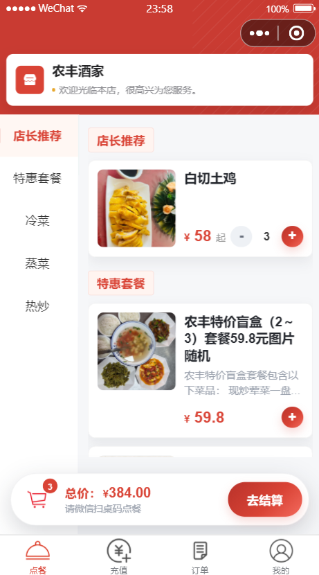
      <br />
      <div align="center">点餐页面</div>
    </td>
    <td width="25%">
      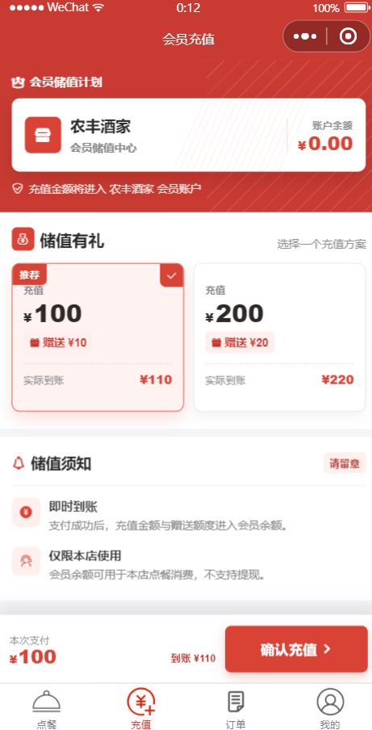
      <br />
      <div align="center">充值页面</div>
    </td>
    <td width="25%">
      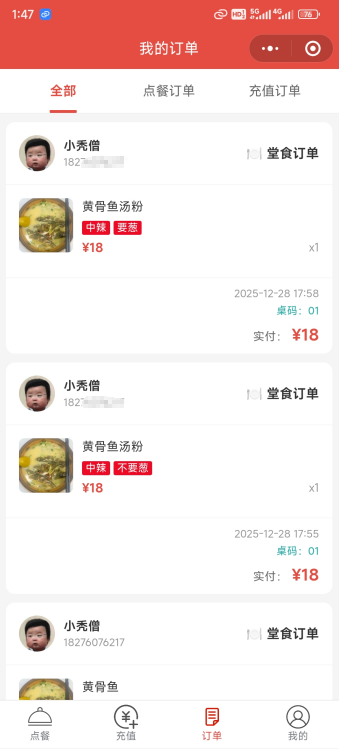
      <br />
      <div align="center">我的订单页面</div>
    </td>
    <td width="25%">
      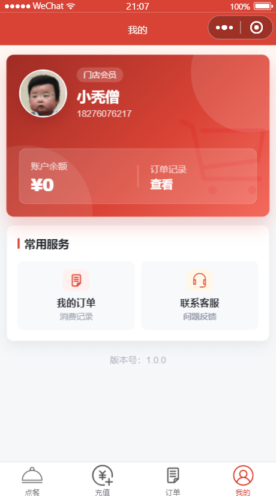
      <br />
      <div align="center">个人中心页面</div>
    </td>
  </tr>
  <tr>
    <td width="25%">
      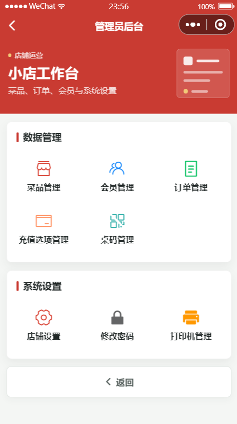
      <br />
      <div align="center">管理员页面</div>
    </td>
    <td width="25%">
      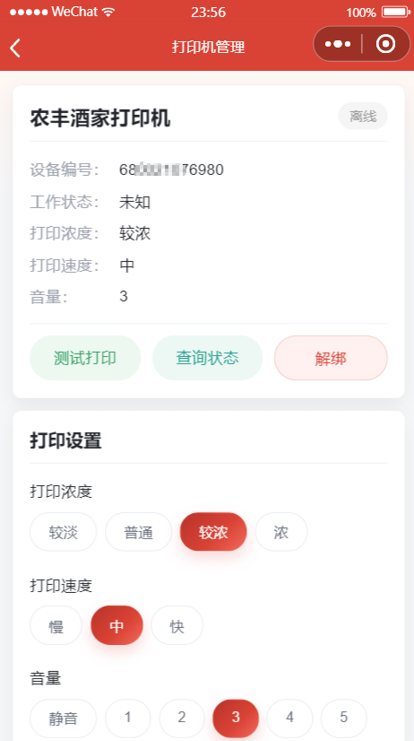
      <br />
      <div align="center">打印机管理页面</div>
    </td>
    <td width="25%">
      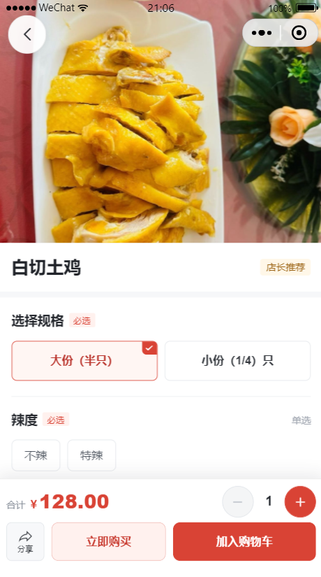
      <br />
      <div align="center">菜品详情页面</div>
    </td>
    <td width="25%">
      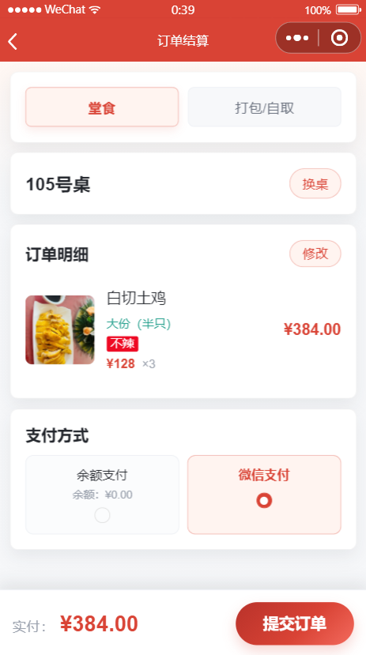
      <br />
      <div align="center">结算订单页面</div>
    </td>
  </tr>
  <tr>
    <td width="25%">
      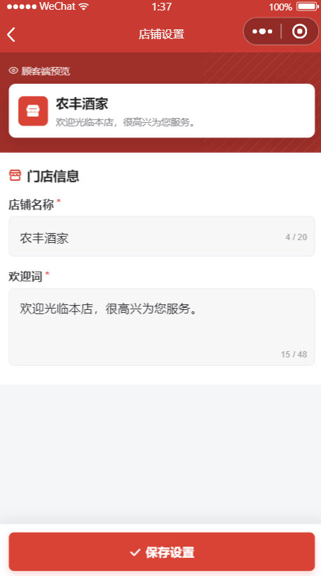
      <br />
      <div align="center">店铺设置页面</div>
    </td>
    <td width="25%">
      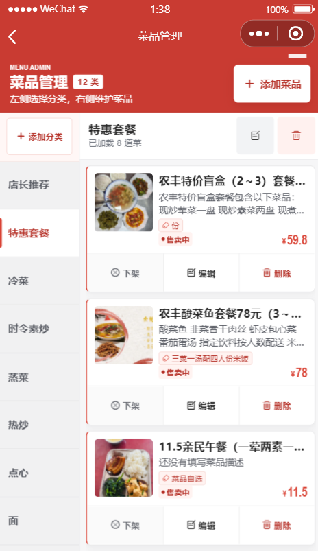
      <br />
      <div align="center">菜品管理页面</div>
    </td>
    <td width="25%">
      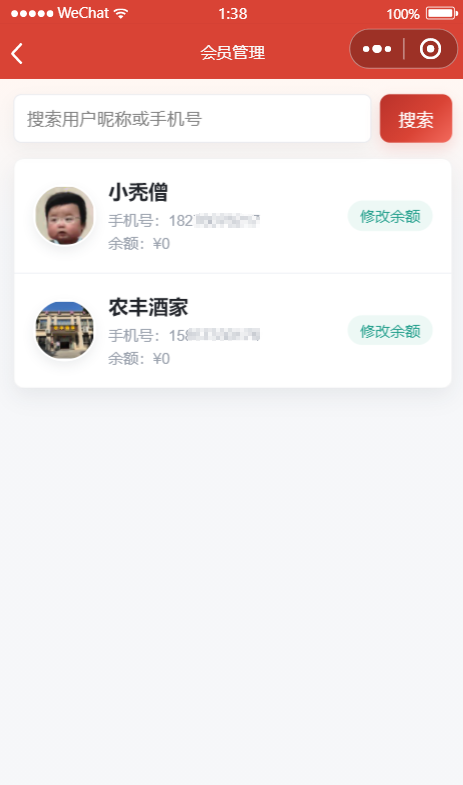
      <br />
      <div align="center">会员管理页面</div>
    </td>
    <td width="25%">
      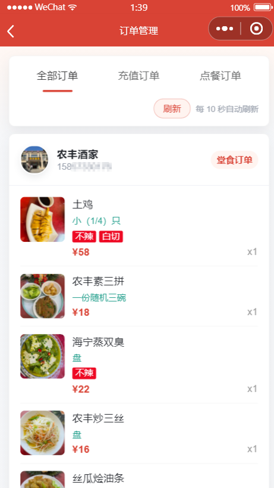
      <br />
      <div align="center">订单管理页面</div>
    </td>
  </tr>
  <tr>
    <td width="25%">
      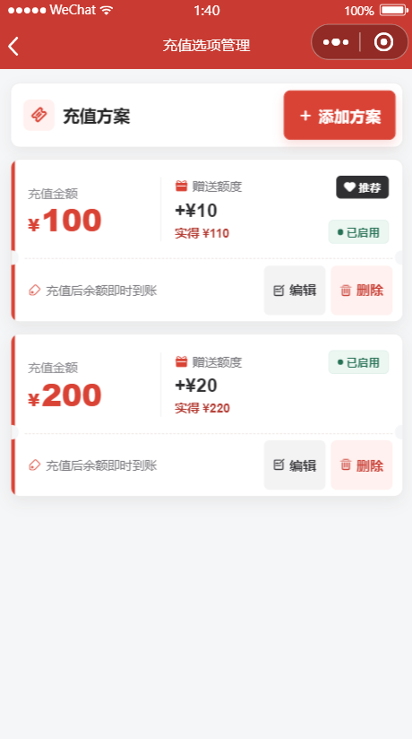
      <br />
      <div align="center">充值选项管理页面</div>
    </td>
    <td width="25%">
      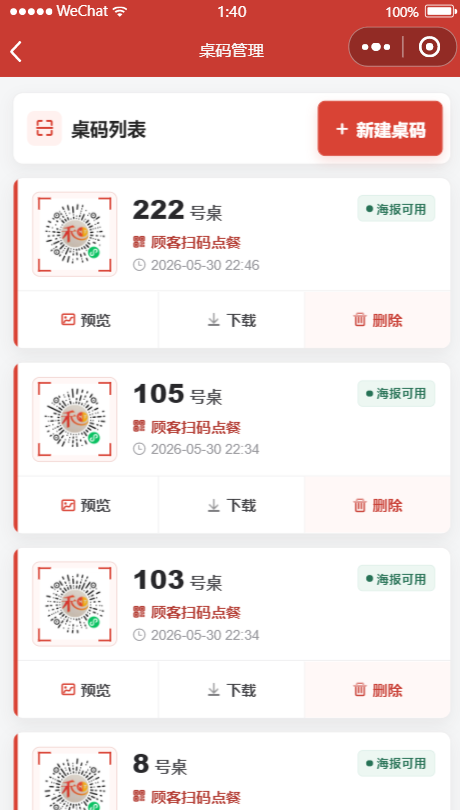
      <br />
      <div align="center">桌码管理页面</div>
    </td>
    <td width="25%">
      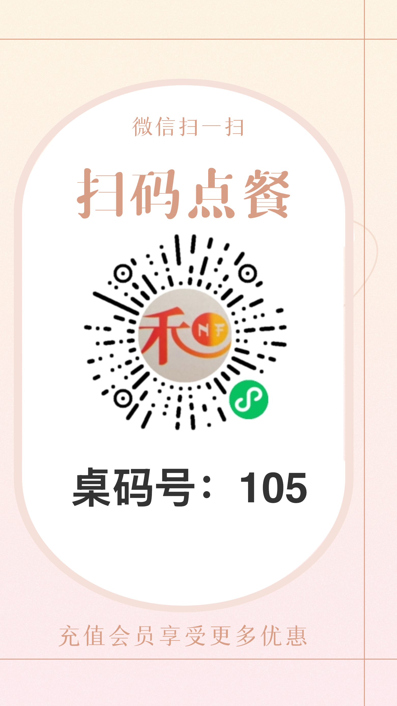
      <br />
      <div align="center">一键生成桌码</div>
    </td>
    <td width="25%">
      
      <br />
      <div align="center">桌码示例</div>
    </td>
  </tr>
  <tr>
    <td width="25%">
      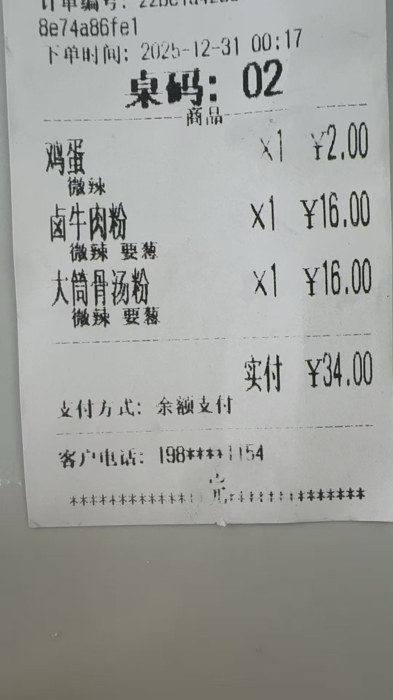
      <br />
      <div align="center">小票示例</div>
    </td>
  </tr>
</table>

<a id="features"></a>
## 功能说明

### 顾客端

#### 在线点餐（支持堂食与打包）

- 菜品分类浏览，层级清晰直观
- 菜品详情查看与分享
- 多规格、多属性选择，不同规格可独立定价
- 购物车管理，操作便捷
- 扫码绑定桌码，订单确认时支持换桌
- 支持微信支付与余额支付

#### 会员充值

- 充值即成为会员
- 多种充值套餐可选，赠送规则灵活配置

#### 订单与个人中心

- 点餐订单与充值记录查询
- 余额实时显示，个人资料查看

#### 照片墙

- 门店照片展示与预览，提升品牌形象

### 管理端

#### 数据管理

- **菜品管理**：菜品的添加、编辑与删除，支持规格价格、属性、图片、描述等配置
- **菜品分类管理**：分类维护与排序
- **会员管理**：会员列表查看，余额调整
- **订单管理**：全部订单统一查看
- **充值选项管理**：充值套餐与赠送规则配置
- **照片管理**：照片上传、预览与删除（同步清理云存储文件）

#### 系统设置

- **店铺设置**：店铺名称与欢迎词配置
- **桌码管理**：桌号信息维护，桌码海报一键生成
- **打印机管理**：小票打印机绑定，支持订单自动打印
- **修改密码**：管理员登录密码维护

> 💡 进入管理端：在"我的"页面右下角连续点击 5 次即可进入管理后台。

### 设计特色

- 红色主题，温馨大气的餐饮氛围
- 简洁现代的 UI 设计
- 流畅的用户体验与细腻的动效

<a id="architecture"></a>
## 技术架构

项目整体分为三层：

- **客户端**：微信小程序原生框架，UI 基于 Vant Weapp 与 ColorUI，通过 `wx.cloud` API 调用云资源。
- **服务层**：微信云函数（Node.js），负责用户登录、下单、支付回调、桌码生成、打印机管理等业务逻辑。
- **数据层**：云数据库存储业务数据（用户、菜品、订单、桌码等），云存储保存菜品图片、桌码海报与照片墙图片。

<a id="structure"></a>
## 目录结构

```text
crush/
├── cloudfunctions/            # 云函数（后端业务逻辑）
│   ├── login/                 # 用户登录，获取 openid
│   ├── getCategory/           # 获取菜品分类
│   ├── doBuy/                 # 下单 / 购买操作
│   ├── pay/                   # 微信支付
│   ├── pay_success/           # 支付成功回调
│   ├── get_code/              # 生成小程序码（桌码）
│   ├── getPhoneNumber/        # 获取手机号
│   ├── getUserList/           # 获取用户列表（管理端）
│   ├── printBack/             # 打印机回调处理
│   └── printManage/           # 打印机管理
├── miniprogram/               # 小程序前端
│   ├── pages/                 # 页面目录
│   │   ├── home/              # 店铺主页（会员 / 照片墙入口）
│   │   ├── index/             # 点餐首页
│   │   ├── dish-detail/       # 菜品详情
│   │   ├── recharge/          # 会员充值
│   │   ├── settle/            # 订单结算
│   │   ├── myorder/           # 我的订单
│   │   ├── myhome/            # 个人中心
│   │   ├── photoWall/         # 照片墙
│   │   └── admin/             # 管理后台
│   │       ├── dish/          # 菜品管理
│   │       ├── dishCategory/  # 菜品分类管理
│   │       ├── user/          # 会员管理
│   │       ├── order/         # 订单管理
│   │       ├── rechargeOptions/ # 充值套餐管理
│   │       ├── photoManage/   # 照片管理
│   │       ├── shopSettings/  # 店铺设置
│   │       ├── tableCode/     # 桌码管理
│   │       └── printer/       # 打印机管理
│   ├── components/            # 通用组件
│   ├── images/                # 运行所需图片资源
│   ├── utils/                 # 工具函数
│   ├── vant/                  # Vant Weapp 组件库
│   ├── app.js                 # 小程序入口
│   ├── app.json               # 小程序配置
│   └── app.wxss               # 全局样式
├── docs/                      # 文档与效果截图
├── intial_data/               # 数据库集合初始化数据（JSON）
├── 数据库集合初始化数据.md       # 初始化数据说明
├── 数据库集合字段说明.md         # 数据库字段说明
├── project.config.json        # 项目配置文件
└── LICENSE                    # MIT 许可证
```

<a id="requirements"></a>
## 环境要求

- 微信开发者工具（最新稳定版）
- 已注册并通过备案的微信小程序账号
- 已开通微信云开发（CloudBase）

<a id="quick-start"></a>
## 快速开始

### 1. 获取项目代码

```bash
git clone https://github.com/MiChuan/crush.git
cd crush
```

### 2. 配置云开发环境

1. 在微信开发者工具中导入项目
2. 开通云开发，创建云环境
3. 在云开发控制台顶部获取云环境 ID

### 3. 修改环境配置

**小程序入口**：修改 `miniprogram/app.js`（第 18 行）中的环境 ID：

```javascript
wx.cloud.init({
  env: '填写你的环境ID',  // 替换为你的实际环境 ID
  traceUser: true,
})
```

**云函数**：将 `cloudfunctions` 目录下各云函数 `index.js` 中的 `'填写你的环境ID'` 替换为实际云环境 ID。涉及：

`login`、`getCategory`、`doBuy`、`pay`、`pay_success`、`get_code`、`getPhoneNumber`、`getUserList`、`printBack`、`printManage`

补充说明：

- `pay/index.js`：需将 `subMchId` 替换为自有商户号
- `printManage/index.js`：需配置打印机平台的 `appid` 与 `appsecret`（可前往 [大趋智能开放平台](https://open.trenditiot.com) 申请）

### 4. 创建数据库集合

在云开发控制台 → 数据库中创建以下集合：

| 集合 | 说明 |
|---|---|
| `user` | 用户表 |
| `dish` | 菜品表 |
| `dishCategory` | 菜单分类表 |
| `order` | 订单表（点餐订单与充值订单） |
| `printer` | 打印机表 |
| `rechargeOptions` | 充值套餐表 |
| `admin` | 管理员与店铺设置表 |
| `tableCode` | 桌码表 |
| `photoWall` | 照片墙表 |

所有集合权限建议设置为自定义安全规则：

```json
{
  "read": true,
  "write": true
}
```

> 💡 提示：可参考《数据库集合初始化数据.md》导入初始化数据，或直接使用 `intial_data/` 目录下的 JSON 文件。

### 5. 上传并部署云函数

在微信开发者工具中，右键点击每个云函数目录，选择"上传并部署：云端安装依赖"。需部署的云函数：

`login`、`getCategory`、`doBuy`、`pay`、`pay_success`、`get_code`、`getPhoneNumber`、`getUserList`、`printBack`、`printManage`

### 6. 配置桌码背景图

将 `docs/images` 目录下的 `bg.png` 上传至云存储并获取 URL，替换 `miniprogram/pages/admin/tableCode/tableCode.js` 中 `bgImg` 变量的值：

```javascript
const bgImg = "你的背景图片 URL"
```

### 7. 编译运行

1. 在微信开发者工具中点击"编译"
2. 小程序将在模拟器中自动运行

### 8. 进入管理后台

1. 点击底部"我的"标签，进入个人中心
2. 在页面右下角空白区域连续快速点击 5 次（1 秒内完成）
3. 首次使用会弹出"设置管理员密码"弹窗，输入至少 6 位密码
4. 设置成功后自动跳转至管理后台，可进行店铺信息、菜品分类、菜品、充值套餐、订单、会员与打印机等管理操作

<a id="before-launch"></a>
## 上线前配置

> 以下事项需在上线前完成，否则对应功能不可用。

### 1. 云数据库配置

- 在云开发控制台创建 9 个集合：`user`、`dish`、`dishCategory`、`order`、`printer`、`rechargeOptions`、`admin`、`tableCode`、`photoWall`
- 导入《数据库集合初始化数据.md》中的初始化数据（必导：`dishCategory`、`dish`、`rechargeOptions`；推荐：`admin`）
- 每个集合权限设置为自定义安全规则：`{ "read": true, "write": true }`
- **影响**：未配置将导致小程序无法获取菜品分类、无法下单等核心功能不可用

### 2. 微信支付商户号

- 前往 [微信支付商户平台](https://pay.weixin.qq.com) 注册并获取商户号（需开通 APIv3 密钥）
- 在微信开发者工具 → 云开发控制台 → 设置 → 授权管理 → 开通云支付，绑定该商户号
- 将商户号填入 `cloudfunctions/pay/index.js` 的 `subMchId` 字段
- **影响**：未配置则点餐微信支付与充值不可用（余额支付不受影响）

### 3. 小票打印机

- 购买支持云打印的小票打印机（约 259 元），前往 [大趋智能开放平台](https://open.trenditiot.com) 注册开发者账号
- 在平台绑定打印机，获取打印机的 `SN` 与 `KEY`
- 在管理后台 → 打印机管理中填写 `SN` / `KEY` 完成绑定
- **影响**：未配置则下单后无法自动打印小票，不影响点餐下单

### 4. 桌码生成

- 桌码页面的路径参数必须为线上真实存在的页面，请在小程序上线后再生成桌码

<a id="faq"></a>
## 常见问题

### 1. 小程序无法获取菜品分类或无法下单

请确认云数据库集合已全部创建，并已导入《数据库集合初始化数据.md》中的初始化数据。

### 2. 支付失败

请确认已完成云支付授权、商户号已绑定，并将商户号正确填入 `cloudfunctions/pay/index.js` 的 `subMchId` 字段。

### 3. 下单后无法自动打印小票

请确认打印机已在管理后台完成绑定，且 `printManage` 云函数中的 `appid` / `appsecret` 配置正确。

### 4. 桌码无法生成

桌码生成依赖线上页面路径，请在小程序发布上线后再执行生成操作。

### 5. 照片墙无法显示图片

请确认已创建 `photoWall` 集合，并检查照片上传时云存储是否可用。

<a id="open-source-statement--copyright"></a>
## 开源声明与版权归属

本项目基于 MIT License 开源发布（详见 [LICENSE](LICENSE)）。在保留原始署名与许可证声明的前提下，使用者可以自由复制、修改、分发、再发布，或用于个人学习、商业项目及二次开发。

若将本项目代码用于课程设计、毕业设计展示或商业部署，建议保留原作者信息、仓库地址及许可说明，以尊重原始创作贡献。

<a id="notes"></a>
## 其他说明

### 技术栈

- 微信云开发：云函数 + 云数据库 + 云存储
- UI 框架：Vant Weapp + ColorUI
- 语言：JavaScript（ES6+）

### 部署成本

- 小程序认证费：约 30 元
- 小票打印机：约 259 元

合计不到 300 元，即可搭建一套自有品牌的点餐小程序。

### 相关文档

- 《数据库集合初始化数据.md》 — 数据库初始化数据说明
- 《数据库集合字段说明.md》 — 数据库字段说明
- 《产品推荐-小餐饮店点餐小程序.md》 — 产品介绍
